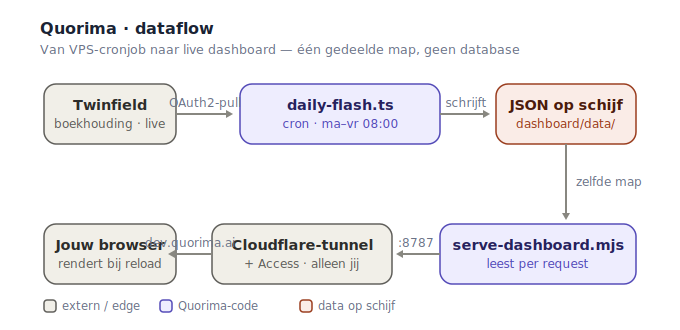

# Quorima — Architectuur & dataflow

> Quorima is een altijd-aan **management-dashboard** dat rechtstreeks uit de
> boekhouding leest en bestuurs-KPI's + openstaande posten **automatisch,
> veilig en zonder handwerk** presenteert. Eén dagelijkse run zet de cijfers
> vers op het scherm; geen exports, geen spreadsheets, geen database.

Geïmplementeerd voor **Sirrapa Group Holding** (holding + werkmaatschappijen),
live op `dev.quorima.ai`.

---

## Dataflow in één oogopslag

De kern: er is **geen aparte "Quorima"-server en geen push**. De cron-taak en de
webserver zijn twee processen op dezelfde VPS die **één map delen**
(`dashboard/data/`). De schrijver zet er JSON neer, de lezer serveert het.

---

## Hoe de data binnenkomt — stap voor stap

1. **Cron** (`0 8 * * 1-5` — werkdagen 08:00) start `deploy/run-flash.sh`.
2. Dat draait **`daily-flash.ts`**: haalt **live uit Twinfield** (OAuth2), berekent
   de KPI's + openstaande posten, en **schrijft twee JSON-feeds** naar
   `dashboard/data/`: `kpi-overview.json` (KPI's) en `open-items.json`
   (crediteuren/debiteuren). Daarnaast: een markdown-flash en een Telegram-status.
3. **`serve-dashboard.mjs`** (systemd-service `quorima-dashboard`, gebonden aan
   `127.0.0.1:8787`) **leest die bestanden vers van schijf bij élk request**
   (`readFile` + `Cache-Control: no-store`) — geen herstart nodig.
4. De **Cloudflare-tunnel** verbindt `localhost:8787` met `dev.quorima.ai`, achter
   **Cloudflare Access** (alleen de geautoriseerde gebruiker).
5. De **browser** laadt `index.html`, doet `fetch('./data/*.json')` en rendert de
   tegels, KPI-kaarten en detail-popups.

---

## Componenten

| Component | Rol | Tech |
|---|---|---|
| Cron + `run-flash.sh` | Dagelijkse trigger + run/fail-melding naar Telegram | crontab, bash |
| `daily-flash.ts` | Haalt data, rekent KPI's, schrijft de feeds | TypeScript (tsx) |
| Twinfield-adapter | Leest grootboek/relaties via de processxml-API | SOAP + OAuth2 |
| JSON-feeds | Overdracht tussen pipeline en dashboard | `dashboard/data/*.json` |
| `serve-dashboard.mjs` | Statische webserver, leest per request van schijf | Node (dependency-vrij) |
| Cloudflare-tunnel + Access | Veilige publieke toegang, alleen geautoriseerd | cloudflared, Zero Trust |
| `index.html` | Rendert tegels, KPI's, detail-modals | HTML + vanilla JS |

---

## Kernprincipes (de marketing-haakjes)

- **Bron-van-waarheid.** Leest direct uit de boekhouding (Twinfield) — geen
  handmatige export, geen overtik-fouten. Eén knop draait alles.
- **Altijd vers.** De webserver leest elke pageview opnieuw van schijf; de cron
  ververst de cijfers dagelijks automatisch.
- **Veilig by design.** Achter Cloudflare Access (alleen geautoriseerde
  gebruikers), géén open poorten op de VPS, en **gevoelige cijfers staan nooit in
  de repository** (de live feeds zijn gitignored; alleen voorbeeld-data is publiek).
- **Lichtgewicht infra.** Eén VPS, **geen database, geen message-queue** — een
  gedeelde map als overdracht. Eenvoudig te begrijpen, goedkoop te draaien.
- **Uitbreidbaar.** Pluggable accounting-connector (Twinfield nu; Xero e.a.
  mogelijk via dezelfde interface) en pluggable LLM voor de narratieve duiding.

---

## Wat het dashboard toont

- **Holding + werkmaatschappijen — KPI's:** o.a. DSCR, NOI en refi-runway per
  entiteit, met kleurcodering (rood/amber/groen) en bron-vermelding.
- **Openstaande posten — crediteuren & debiteuren** uit Twinfield, als klikbare
  totaal-tegels (te betalen / te ontvangen / vooruitbetaald) met een
  **detail-popup** per relatie en subtotalen per entiteit.
- **Flags & escalaties** uit de board-agents.

---

## Verversing & nuances (eerlijk vermeld)

- De browser ververst **niet automatisch** — na de 08:00-run zie je nieuwe cijfers
  zodra je de pagina opent of herlaadt. (Auto-refresh is een kleine toevoeging.)
- De openstaande posten tonen de **geboekte stand**: een betaling die nog niet in
  Twinfield is afgeletterd telt mee als openstaand. Per-factuur-detail
  (factuurnummer/vervaldatum) is op deze Twinfield-cluster niet via de API
  beschikbaar; de cijfers zijn netto-openstaand per relatie.

---

## Bestanden (voor wie het nabouwt of presenteert)

- **Pipeline:** `quorima-mvp/src/cli/daily-flash.ts`,
  `src/digest/dashboard-feed.ts`, `src/digest/open-items-feed.ts`,
  `src/adapters/twinfield/` (adapter + OAuth2 + account-classify)
- **Hosting:** `deploy/run-flash.sh`, `deploy/serve-dashboard.mjs`,
  `deploy/quorima-dashboard.service`, `deploy/quorima-flash.cron`,
  `deploy/DEPLOY-hermes.md` (runbook)
- **Frontend:** `dashboard/index.html`, `dashboard/data/*.example.json`
- **Diagram:** `docs/quorima-dataflow.svg` (deze pagina)
